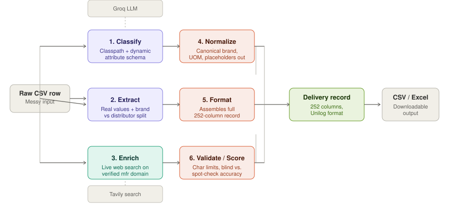

# CatalogIQ
 
CatalogIQ is a Unilog hackathon submission: an AI pipeline that turns messy industrial catalog rows into complete, standardized product records matching Unilog's exact 252-column delivery format.
 
Raw distributor data is genuinely unusable as-is — cryptic descriptions ("PDSH4816AF Dishwasher SS"), placeholder brand fields ("-- Unbranded --"), and a "manufacturer" field that's often actually a distributor's name. CatalogIQ automates the cleanup, live, without fabricating data.
 
## Architecture
 

 
Six real pipeline stages, all live, none mocked:
 
1. **Classify** — an LLM reads the raw text and dynamically generates both the product's taxonomy classpath and the exact attribute schema that category needs — no static per-category templates.
2. **Extract** — pulls real values from the description, distinguishing the actual brand mentioned in text from a distributor name sitting in a separate field.
3. **Enrich** — when data is incomplete, runs a live web search (Tavily) to discover the manufacturer's real official domain, verifies it isn't a marketplace or reseller, then pulls genuine specs, images, and documents from their site.
4. **Normalize** — canonicalizes brand names, standardizes units of measure, strips placeholder values.
5. **Format** — assembles the full 252-column delivery record in Unilog's exact column order.
6. **Validate / Score** — checks character-limit compliance, and reports accuracy split between blind rows (no known answer) and spot-checks (known ground-truth rows), with a leak-guard confirming no answer-key peeking.
**Core rule:** if a fact can't be confidently verified from a real source, the field stays blank and the row is flagged for review. A wrong value is worse than an empty one.
 
## Getting started
 
```bash
git clone https://github.com/s2kumar2007/catalogiq.git
cd catalogiq
npm install
```
 
Create `.env.local` with:
 
```
GROQ_API_KEY=your_key_here
TAVILY_API_KEY=your_key_here
```
 
Run the web app:
 
```bash
npm run dev
```
 
Or run the CLI batch pipeline directly:
 
```bash
npm run enrich -- --mfr=dishwasher
```
 
(`--mfr` filters the input dataset by a substring match on the description or manufacturer field — useful for testing against a small slice instead of the full 1,000-row dataset.)
 
## Output
 
- Web UI: upload a CSV or paste raw text, watch it classify and enrich live, download the result as CSV or Excel.
- CLI: writes `outputs/catalogiq_unilog_delivery.csv` (enriched rows in the exact delivery-column order) and `outputs/catalogiq_unilog_report.json` (run summary, accuracy scoring, trace samples).
## Data
 
- `Data/Unihack_ Sample Dataset - Input.csv` — 1,000-row raw working input.
- `Data/Unihack_ Expected Output - Delivery Format (1).csv` — the 252-column schema plus 2 labelled ground-truth rows, used for spot-check scoring.
## Known limitations
 
- Free-tier Groq and Tavily rate limits are the current bottleneck for scaling to the full 1,000-row dataset — a known, solvable next step, not a design flaw.
- Digital assets (product images, spec sheet PDFs) and secondary fields (warranty, certifications) populate only where the manufacturer's own site actually publishes that data — coverage naturally varies by product category, and that unevenness is expected, honest behavior rather than a bug.
- We prioritized depth on real categories over a shallow pass across all 1,000 rows, since proving accuracy matters more than raw row count.
